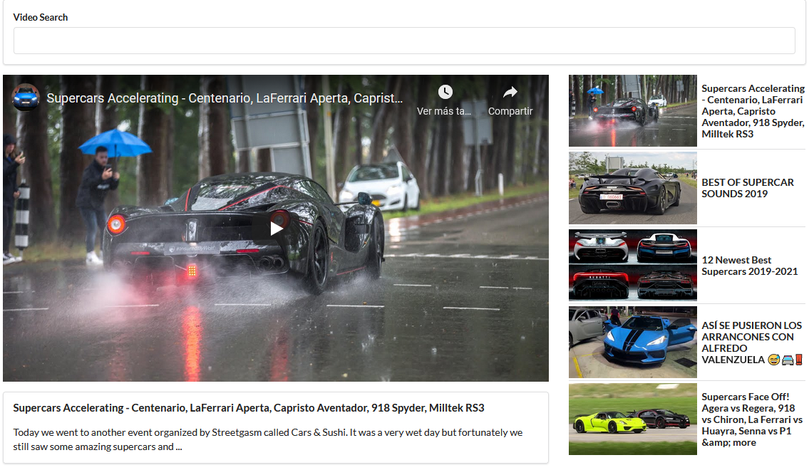

# Video Search

This app uses the YouTube API, this is a very simple app where you can search for videos, these videos are gotten from YouTube using its API.
You can get up to five videos per search.

## Built With

- JS,
- React,
- CSS,
- JSX,
- Axios,
- YouTube API

### Setup

- To clone this repo you have to open your terminal and then type `git clone  https://github.com/balerum03/videos-react.git` on the folder where you want this project to be saved.
- Then run `npm install to install packages`.
- Before running the server create a file called `youtube.js` in the src folder, and there make sure you have the following code: `const KEY = 'your youtube API key' export default KEY`
- Run the server with `npm run start`.
- The app will open on your default browser.

## Author

👤 **Adan Fernandez Bonilla**

- Github: [@balerum03](https://github.com/balerum03)
- Twitter: [@balerum03](https://twitter.com/balerum03)
- Linkedin: [linkedin](https://www.linkedin.com/in/adan-fernandez-bonilla/)

## 🤝 Contributing

Contributions, issues and feature requests are welcome!

Feel free to check the [issues page](issues/).

## Show your support

Give a ⭐️ if you like this project!

## Acknowledgments

- Hat tip to anyone whose code was used
- Inspiration
- etc

## 📝 License

This project is [MIT](lic.url) licensed.
